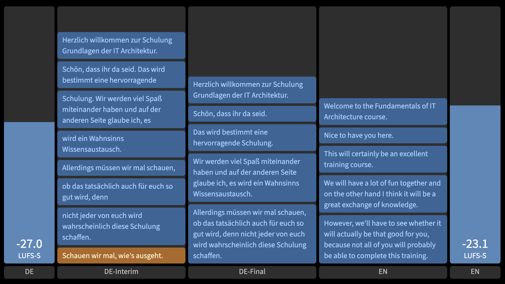

SpeechFlow
==========

**Speech Processing Flow Graph**

[](https://github.com/rse)
[](https://github.com/rse)
[](https://github.com/rse/speechflow)
[](https://github.com/rse/speechflow)

About
-----

**SpeechFlow** is a command-line interface based tool for macOS,
Windows and Linux, establishing a directed data flow graph of audio
and text processing nodes. This way, it allows to perform various
speech processing tasks in a very flexible and configurable way. The
usual supported tasks are capturing audio, generate narrations of
text (aka text-to-speech), generate transcriptions or subtitles for
audio (aka speech-to-text), and generate translations for audio (aka
speech-to-speech).

**SpeechFlow** comes with built-in graph nodes for various functionalities:

- file and audio device I/O for local connectivity,
- WebSocket, MQTT, VBAN, and WebRTC network I/O for remote connectivity,
- external command execution I/O for process integration,
- local Voice Activity Detection (VAD),
- local voice gender recognition,
- local audio LUFS-S/RMS metering,
- local audio Speex, RNNoise, and GTCRN noise suppression,
- local audio compressor and expander dynamics processing,
- local audio gain adjustment,
- local audio pitch shifting and time stretching,
- local audio gap filler processing,
- remote-controlable audio muting,
- cloud-based speech-to-text conversion with
  [Amazon Transcribe](https://aws.amazon.com/transcribe/),
  [OpenAI GPT-Transcribe](https://platform.openai.com/docs/models/gpt-4o-mini-transcribe),
  [Deepgram](https://deepgram.com), or
  [Google Cloud Speech-to-Text](https://cloud.google.com/speech-to-text).
- cloud-based text-to-text translation (or spelling correction) with
  [DeepL](https://deepl.com),
  [Amazon Translate](https://aws.amazon.com/translate/),
  [Google Cloud Translate](https://cloud.google.com/translate),
  [OpenAI GPT](https://openai.com),
  [Anthropic Claude](https://anthropic.com), or
  [Google Gemini](https://ai.google.dev).
- local text-to-text translation (or spelling correction) with
  [Ollama](https://ollama.com) or
  [OPUS-MT](https://github.com/Helsinki-NLP/Opus-MT).
- cloud-based text-to-speech conversion with
  [OpenAI TTS](https://platform.openai.com/docs/guides/text-to-speech),
  [ElevenLabs](https://elevenlabs.io/),
  [Amazon Polly](https://aws.amazon.com/polly/), or
  [Google Cloud Text-to-Speech](https://cloud.google.com/text-to-speech).
- local text-to-speech conversion with
  [Kokoro](https://github.com/nazdridoy/kokoro-tts) or
  [Supertonic](https://huggingface.co/Supertone/supertonic).
- local [FFmpeg](https://ffmpeg.org/)-based speech-to-speech conversion,
- local WAV speech-to-speech decoding/encoding,
- local text-to-text formatting, regex-based modification,
  sentencing merging/splitting,
  subtitle generation, and formatting.
- local text or audio chunk filtering and tracing.

Additional, **SpeechFlow** graph nodes can be provided externally
by NPM packages named `speechflow-node-xxx` which expose a class
derived from the exported `SpeechFlowNode` class of the `speechflow` package.

**SpeechFlow** is written in TypeScript and
ships as an installable package for the Node Package Manager (NPM).

Impression
----------

**SpeechFlow** is a command-line interface (CLI) based tool, so there
is no exciting screenshot possible from its CLI appearance, of course.
Instead, here is a sample of a fictive training which is held in German
and real-time translated to English.

First, the used configuration was a straight linear pipeline in file `sample.conf`:

```txt
xio-device(device: env.SPEECHFLOW_DEVICE_MIC, mode: "r") |
a2a-meter(interval: 50, dashboard: "meter1") |
a2t-deepgram(language: "de", model: "nova-2", interim: true) |
x2x-trace(type: "text", dashboard: "text1") |
x2x-filter(name: "final", type: "text", var: "kind", op: "==", val: "final") |
t2t-sentence() |
x2x-trace(type: "text", dashboard: "text2") |
t2t-deepl(src: "de", dst: "en") |
x2x-trace(type: "text", dashboard: "text3") |
t2a-elevenlabs(voice: "Mark", optimize: "latency", speed: 1.05, language: "en") |
a2a-meter(interval: 50, dashboard: "meter2") |
xio-device(device: env.SPEECHFLOW_DEVICE_SPK, mode: "w")
```

Second, the corresponding **SpeechFlow** command was:

```sh
$ speechflow -v info -c sample.conf \
  -d audio:meter1:DE,text:text1:DE-Interim,text:text2:DE-Final,text:text3:EN,audio:meter2:EN
```

Finally, the resulting dashboard under URL `http://127.0.0.1:8484/` was:



On the left you can see the volume meter of the microphone (`xio-device`),
followed by the German result of the speech-to-text conversion
(`a2t-deepgram`), followed by the still German results of the text-to-text
sentence splitting/aggregation (`t2t-sentence`), followed by the English
results of the text-to-text translation (`t2t-deepl`) and then finally on
the right you can see the volume meter of the text-to-speech conversion
(`t2a-elevenlabs`).

The entire **SpeechFlow** processing pipeline runs in real-time and
the latency between input and output audio is about 2-3 seconds, very
similar to the usual latency human live translators also cause. The
latency primarily comes from the speech-to-text part in the pipeline,
as the end of sentences have to be awaited -- especially in the German
language where the verb can come very late in a sentence. So, the
latency is primarily not caused by any technical aspects, but by the
nature of live translation.

Installation
------------

```sh
$ npm install -g speechflow
```

Usage
-----

```txt
$ speechflow
  [-h|--help]
  [-V|--version]
  [-S|--status]
  [-v|--verbose <level>]
  [-a|--address <ip-address>]
  [-p|--port <tcp-port>]
  [-C|--cache <directory>]
  [-e|--expression <expression>]
  [-f|--file <file>]
  [-c|--config <id>@<yaml-config-file>]
  [<argument> [...]]
```

Graph Expression Language
-------------------------

The **SpeechFlow** graph expression language is based on
[**FlowLink**](https://npmjs.org/flowlink), which itself has a language
following the following BNF-style grammar:

```txt
#   (sub-)graph expression: set or sequence of nodes, single node, or group
expr             ::= parallel
                   | sequential
                   | node
                   | group

#   set of nodes, connected in parallel
parallel         ::= sequential ("," sequential)+

#   sequence of nodes, connected in chain
sequential       ::= node ("|" node)+

#   single node with optional parameter(s) and optional links
node             ::= id ("(" (param ("," param)*)? ")")? links?

#   single parameter: array, object, variable reference, template string,
#   or string/number literal, or special value literal
param            ::= array | object | variable | template | string | number | value

#   set of links
links            ::= link (_ link)*
link             ::= "<" | "<<" | ">" | ">>" id

#   group with sub-graph
group            ::= "{" expr "}"

#   identifier and variable
id               ::= /[a-zA-Z_][a-zA-Z0-9_-]*/
variable         ::= id

#   array of values
array            ::= "[" (param ("," param)*)? "]"

#   object of key/valus
object           ::= "{" (id ":" param ("," id ":" param)*)? "}"

#   template string
template         ::= "`" ("${" variable "}" / ("\\`"|.))* "`"

#   string literal
string           ::= /"(\\"|.)*"/
                   | /'(\\'|.)*'/

#   number literal
number           ::= /[+-]?/ number-value
number-value     ::= "0b" /[01]+/
                   | "0o" /[0-7]+/
                   | "0x" /[0-9a-fA-F]+/
                   | /[0-9]*\.[0-9]+([eE][+-]?[0-9]+)?/
                   | /[0-9]+/

#   special value literal
value            ::= "true" | "false" | "null" | "NaN" | "undefined"
```

**SpeechFlow** makes available to **FlowLink** all **SpeechFlow** nodes as
`node`, the CLI arguments under the array `variable` named `argv`, and all
environment variables under the object `variable` named `env`.

Processing Graph Examples
-------------------------

The following are examples of particular **SpeechFlow** processing graphs.
They can also be found in the sample [speechflow.yaml](./etc/speechflow.yaml) file.

- **Capturing**: Capture audio from microphone device into WAV audio file:

  ```
  xio-device(device: env.SPEECHFLOW_DEVICE_MIC, mode: "r") |
      a2a-wav(mode: "encode", seekable: true) |
          xio-file(path: "capture.wav", mode: "w", type: "audio", seekable: true)
  ```

- **Pass-Through**: Pass-through audio from microphone device to speaker
  device and in parallel record it to WAV audio file:

  ```
  xio-device(device: env.SPEECHFLOW_DEVICE_MIC, mode: "r") | {
      a2a-wav(mode: "encode") |
          xio-file(path: "capture.wav", mode: "w", type: "audio"),
      xio-device(device: env.SPEECHFLOW_DEVICE_SPK, mode: "w")
  }
  ```

- **Transcription**: Generate text file with German transcription of WAV audio file:

  ```
  xio-file(path: argv.0, mode: "r", type: "audio") |
      a2a-wav("mode: "decode") |
          a2t-deepgram(language: "de") |
              t2t-format(width: 80) |
                  xio-file(path: argv.1, mode: "w", type: "text")
  ```

- **Subtitling**: Generate WebVTT file with German subtitles of WAV audio file:

  ```
  xio-file(path: argv.0, mode: "r", type: "audio") |
      a2a-wav("mode: "decode") |
          a2t-deepgram(language: "de") |
              t2t-subtitle(format: "vtt") |
                  xio-file(path: argv.1, mode: "w", type: "text")
  ```

- **Synthesis**: Generate WAV audio file from WebVTT file containing German subtitles:

  ```
  xio-file(path: argv.0, mode: "r", type: "text") |
      t2t-subtitle(format: "vtt", mode: "import") |
          t2a-elevenlabs(voice: "Mark", optimize: "quality", speed: 1.05, language: "en") |
              a2a-filler() |
                  a2a-wav(mode: "encode") |
                      xio-file(path: argv.1, mode: "w", type: "audio")
  ```

- **Speaking**: Generate audio file with English voice for a text file:

  ```
  xio-file(path: argv.0, mode: "r", type: "text") |
      t2a-kokoro(language: "en") |
          a2a-wav(mode: "encode") |
              xio-file(path: argv.1, mode: "w", type: "audio")
  ```

- **Ad-Hoc Translation**: Ad-Hoc text translation from German to English
  via stdin/stdout:

  ```
  xio-file(path: "-", mode: "r", type: "text") |
      t2t-deepl(src: "de", dst: "en") |
          xio-file(path: "-", mode: "w", type: "text")
  ```

- **Studio Translation**: Real-time studio translation from German to English,
  including the capturing of all involved inputs and outputs:

  ```
  xio-device(device: env.SPEECHFLOW_DEVICE_MIC, mode: "r") | {
      a2a-gender() | {
          a2a-meter(interval: 250) |
              a2a-wav(mode: "encode") |
                  xio-file(path: "program-de.wav", mode: "w", type: "audio"),
          a2t-deepgram(language: "de") | {
              t2t-sentence() | {
                  t2t-format(width: 80) |
                      xio-file(path: "program-de.txt", mode: "w", type: "text"),
                  t2t-deepl(src: "de", dst: "en") | {
                      x2x-trace(name: "text", type: "text") | {
                          t2t-format(width: 80) |
                              xio-file(path: "program-en.txt", mode: "w", type: "text"),
                          t2t-subtitle(format: "srt") |
                              xio-file(path: "program-en.srt", mode: "w", type: "text"),
                          xio-mqtt(url: "mqtt://10.1.0.10:1883",
                              username: env.SPEECHFLOW_MQTT_USER,
                              password: env.SPEECHFLOW_MQTT_PASS,
                              topicWrite: "stream/studio/sender"),
                          {
                              x2x-filter(name: "S2T-male", type: "text", var: "meta:gender", op: "==", val: "male") |
                                  t2a-elevenlabs(voice: "Mark", optimize: "latency", speed: 1.05, language: "en"),
                              x2x-filter(name: "S2T-female", type: "text", var: "meta:gender", op: "==", val: "female") |
                                  t2a-elevenlabs(voice: "Brittney", optimize: "latency", speed: 1.05, language: "en")
                          } | {
                              a2a-wav(mode: "encode") |
                                  xio-file(path: "program-en.wav", mode: "w", type: "audio"),
                              xio-device(device: env.SPEECHFLOW_DEVICE_SPK, mode: "w")
                          }
                      }
                  }
              }
          }
      }
  }
  ```

Processing Node Types
---------------------

First a short overview of the available processing nodes:

- Input/Output nodes:
  **xio-file**,
  **xio-device**,
  **xio-websocket**,
  **xio-mqtt**,
  **xio-vban**,
  **xio-webrtc**,
  **xio-exec**.
- Audio-to-Audio nodes:
  **a2a-ffmpeg**,
  **a2a-wav**,
  **a2a-mute**,
  **a2a-meter**,
  **a2a-vad**,
  **a2a-gender**,
  **a2a-speex**,
  **a2a-rnnoise**,
  **a2a-gtcrn**,
  **a2a-compressor**,
  **a2a-expander**,
  **a2a-gain**,
  **a2a-pitch**,
  **a2a-filler**.
- Audio-to-Text nodes:
  **a2t-openai**,
  **a2t-amazon**,
  **a2t-deepgram**,
  **a2t-google**.
- Text-to-Text nodes:
  **t2t-deepl**,
  **t2t-amazon**,
  **t2t-opus**,
  **t2t-google**,
  **t2t-translate**,
  **t2t-spellcheck**,
  **t2t-punctuation**,
  **t2t-modify**,
  **t2t-profanity**,
  **t2t-summary**,
  **t2t-subtitle**,
  **t2t-format**,
  **t2t-sentence**.
- Text-to-Audio nodes:
  **t2a-openai**,
  **t2a-amazon**,
  **t2a-elevenlabs**,
  **t2a-google**,
  **t2a-kokoro**,
  **t2a-supertonic**.
- Any-to-Any nodes:
  **x2x-filter**,
  **x2x-trace**.

### Input/Output Nodes

The following nodes are for external I/O, i.e, to read/write from
external files, devices and network services.

- Node:    **xio-file**<br/>
  Purpose: **File and StdIO source/sink**<br/>
  Example: `xio-file(path: "capture.pcm", mode: "w", type: "audio")`

  > This node allows the reading/writing from/to files or from StdIO. It
  > is intended to be used as source and sink nodes in batch processing,
  > and as sing nodes in real-time processing. When `seekable` is enabled
  > for write mode, the node uses a file descriptor allowing random access
  > writes to specific file positions via the `chunk:seek` metadata field.
  > Option `seekable` cannot be used on StdIO.

  | Port    | Payload     |
  | ------- | ----------- |
  | input   | text, audio |
  | output  | text, audio |

  | Parameter      | Position  | Default  | Requirement           |
  | -------------- | --------- | -------- | --------------------- |
  | **path**       | 0         | *none*   | *none*                |
  | **mode**       | 1         | "r"      | `/^(?:r\|w)$/`        |
  | **type**       | 2         | "audio"  | `/^(?:audio\|text)$/` |
  | **seekable**   |           | false    | *none*                |
  | **chunkAudio** |           | 200      | `10 <= n <= 1000`     |
  | **chunkText**  |           | 65536    | `1024 <= n <= 131072` |

- Node: **xio-device**<br/>
  Purpose: **Microphone/speaker device source/sink**<br/>
  Example: `xio-device(device: env.SPEECHFLOW_DEVICE_MIC, mode: "r")`

  > This node allows the reading/writing from/to audio devices. It is
  > intended to be used as source nodes for microphone devices and as
  > sink nodes for speaker devices.

  | Port    | Payload     |
  | ------- | ----------- |
  | input   | audio       |
  | output  | audio       |

  | Parameter   | Position  | Default  | Requirement        |
  | ----------- | --------- | -------- | ------------------ |
  | **device**  | 0         | *none*   | `/^(.+?):(.+)$/`   |
  | **mode**    | 1         | "rw"     | `/^(?:r\|w\|rw)$/` |
  | **chunk**   | 2         | 200      | `10 <= n <= 1000`  |

- Node: **xio-websocket**<br/>
  Purpose: **WebSocket source/sink**<br/>
  Example: `xio-websocket(connect: "ws://127.0.0.1:12345", type: "text")`
  Notice: this node requires a peer WebSocket service!

  > This node allows reading/writing from/to WebSocket network services.
  > It is primarily intended to be used for sending out the text of
  > subtitles, but can be also used for receiving the text to be
  > processed.

  | Port    | Payload     |
  | ------- | ----------- |
  | input   | text, audio |
  | output  | text, audio |

  | Parameter   | Position  | Default  | Requirement           |
  | ----------- | --------- | -------- | --------------------- |
  | **listen**  | *none*    | *none*   | `/^(?:\|ws:\/\/(.+?):(\d+))$/` |
  | **connect** | *none*    | *none*   | `/^(?:\|ws:\/\/(.+?):(\d+)(?:\/.*)?)$/` |
  | **mode**    | *none*    | "r"      | `/^(?:r\|w\|rw)$/`    |
  | **type**    | *none*    | "text"   | `/^(?:audio\|text)$/` |

- Node: **xio-mqtt**<br/>
  Purpose: **MQTT source/sink**<br/>
  Example: `xio-mqtt(url: "mqtt://127.0.0.1:1883", username: "foo", password: "bar", topicWrite: "quux")`
  Notice: this node requires a peer MQTT broker!

  > This node allows reading/writing from/to MQTT broker topics. It is
  > primarily intended to be used for sending out the text of subtitles,
  > but can be also used for receiving the text to be processed.

  | Port    | Payload     |
  | ------- | ----------- |
  | input   | text, audio |
  | output  | text, audio |

  | Parameter      | Position  | Default  | Requirement           |
  | -------------- | --------- | -------- | --------------------- |
  | **url**        | 0         | *none*   | `/^(?:\|(?:ws\|mqtt):\/\/(.+?):(\d+)(?:\/.*)?)$/` |
  | **username**   | 1         | *none*   | `/^.+$/` |
  | **password**   | 2         | *none*   | `/^.+$/` |
  | **topicRead**  | 3         | *none*   | `/^.+$/` |
  | **topicWrite** | 4         | *none*   | `/^.+$/` |
  | **mode**       | 5         | "w"      | `/^(?:r\|w\|rw)$/` |
  | **type**       | 6         | "text"   | `/^(?:audio\|text)$/` |

- Node: **xio-vban**<br/>
  Purpose: **VBAN network audio source/sink**<br/>
  Example: `xio-vban(listen: 6980, stream: "Stream1", mode: "r")`
  Notice: this node requires a peer VBAN-compatible application!

  > This node allows reading/writing audio from/to VBAN (VoiceMeeter
  > Audio Network) protocol endpoints. It is intended to be used for
  > real-time audio streaming with applications like VoiceMeeter,
  > VB-Audio Matrix, or other VBAN-compatible software. It supports
  > various audio bit resolutions (8-bit, 16-bit, 24-bit, 32-bit,
  > float32, float64) and automatic channel downmixing to mono.

  | Port    | Payload     |
  | ------- | ----------- |
  | input   | audio       |
  | output  | audio       |

  | Parameter   | Position  | Default   | Requirement                  |
  | ----------- | --------- | --------- | ---------------------------- |
  | **listen**  | 0         | ""        | `/^(?:\|\d+\|.+?:\d+)$/`     |
  | **connect** | 1         | ""        | `/^(?:\|.+?:\d+)$/`          |
  | **stream**  | 2         | "Stream"  | `/^.{1,16}$/`                |
  | **mode**    | 3         | "rw"      | `/^(?:r\|w\|rw)$/`           |

- Node: **xio-webrtc**<br/>
  Purpose: **WebRTC audio streaming source (WHIP) or sink (WHEP)**<br/>
  Example: `xio-webrtc(listen: 8085, path: "/webrtc", mode: "r")`

  > This node allows real-time audio streaming using WebRTC technology
  > via WebRTC-HTTP Ingestion Protocol (WHIP) or WebRTC-HTTP Egress
  > Protocol (WHEP). It provides an HTTP server for SDP negotiation
  > and uses Opus codec for audio encoding/decoding at 48kHz. The node
  > can operate in WHIP mode (i.e., read mode where publishers POST
  > SDP offers to SpeechFlow and SpeechFlow receives audio stream from
  > them) or WHEP mode (i.e., write mode where viewers POST SDP offers
  > to SpeechFlow and SpeechFlow sends audio stream to them). This node
  > supports multiple simultaneous connections, configurable ICE servers
  > for NAT traversal, and automatic connection lifecycle management.

  | Port    | Payload     |
  | ------- | ----------- |
  | input   | audio       |
  | output  | audio       |

  | Parameter      | Position  | Default   | Requirement                  |
  | -------------- | --------- | --------- | ---------------------------- |
  | **listen**     | 0         | "8085"    | `/^(?:\d+\|.+?:\d+)$/`       |
  | **path**       | 1         | "/webrtc" | `/^\/.+$/`                   |
  | **mode**       | 2         | "r"       | `/^(?:r\|w)$/`               |
  | **iceServers** | 3         | ""        | `/^.*$/`                     |

- Node: **xio-exec**<br/>
  Purpose: **External command execution source/sink**<br/>
  Example: `xio-exec(command: "ffmpeg -i - -f s16le -", mode: "rw", type: "audio")`

  > This node allows reading/writing from/to external commands via stdin/stdout.
  > It executes arbitrary commands and pipes audio or text data through them,
  > enabling integration with external processing tools. The node supports
  > read-only mode (capturing stdout), write-only mode (sending to stdin),
  > and bidirectional mode (both stdin and stdout). This is useful for integrating
  > external audio/text processing tools like FFmpeg, SoX, or custom scripts into
  > the SpeechFlow pipeline.

  | Port    | Payload     |
  | ------- | ----------- |
  | input   | text, audio |
  | output  | text, audio |

  | Parameter      | Position  | Default  | Requirement           |
  | -------------- | --------- | -------- | --------------------- |
  | **command**    | 0         | ""       | *required*            |
  | **mode**       | 1         | "r"      | `/^(?:r\|w\|rw)$/`    |
  | **type**       | 2         | "audio"  | `/^(?:audio\|text)$/` |
  | **chunkAudio** | *none*    | 200      | `10 <= n <= 1000`     |
  | **chunkText**  | *none*    | 65536    | `1024 <= n <= 131072` |

### Audio-to-Audio Nodes

The following nodes process audio chunks only.

- Node: **a2a-ffmpeg**<br/>
  Purpose: **FFmpeg audio format conversion**<br/>
  Example: `a2a-ffmpeg(src: "pcm", dst: "mp3")`

  > This node allows converting between audio formats. It is primarily
  > intended to support the reading/writing of external MP3 and Opus
  > format files, although SpeechFlow internally uses PCM format only.

  | Port    | Payload     |
  | ------- | ----------- |
  | input   | audio       |
  | output  | audio       |

  | Parameter | Position  | Default  | Requirement        |
  | --------- | --------- | -------- | ------------------ |
  | **src**   | 0         | "pcm"    | `/^(?:pcm\|wav\|mp3\|opus)$/` |
  | **dst**   | 1         | "wav"    | `/^(?:pcm\|wav\|mp3\|opus)$/` |

- Node: **a2a-wav**<br/>
  Purpose: **WAV audio format conversion**<br/>
  Example: `a2a-wav(mode: "encode")`

  > This node allows converting between PCM and WAV audio formats. It is
  > primarily intended to support the reading/writing of external WAV
  > format files, although SpeechFlow internally uses PCM format only.
  > When `seekable` is enabled in encode mode, the node writes a corrected
  > WAV header at the end of processing with accurate file size information
  > by seeking back to position 0, producing standard-compliant WAV files.
  > Option `seekable` requires a seekable output stream.

  | Port    | Payload     |
  | ------- | ----------- |
  | input   | audio       |
  | output  | audio       |

  | Parameter    | Position  | Default  | Requirement              |
  | ------------ | --------- | -------- | ------------------------ |
  | **mode**     | 0         | "encode" | `/^(?:encode\|decode)$/` |
  | **seekable** | 1         | false    | *none*                   |

- Node: **a2a-mute**<br/>
  Purpose: **volume muting node**<br/>
  Example: `a2a-mute()`
  Notice: this node has to be externally controlled via REST/WebSockets!

  > This node allows muting the audio stream by either silencing or even
  > unplugging. It has to be externally controlled via REST/WebSocket (see below).

  | Port    | Payload     |
  | ------- | ----------- |
  | input   | audio       |
  | output  | audio       |

  | Parameter | Position  | Default  | Requirement              |
  | --------- | --------- | -------- | ------------------------ |

- Node: **a2a-meter**<br/>
  Purpose: **Loudness metering node**<br/>
  Example: `a2a-meter(250)`

  > This node allows measuring the loudness of the audio stream. The
  > results are emitted to both the logfile of **SpeechFlow** and the
  > WebSockets API (see below). It can optionally send the meter
  > information to the dashboard.

  | Port    | Payload     |
  | ------- | ----------- |
  | input   | audio       |
  | output  | audio       |

  | Parameter     | Position  | Default  | Requirement            |
  | ------------- | --------- | -------- | ---------------------- |
  | **interval**  | 0         | 100      | *none*                 |
  | **mode**      | 1         | "filter" | `/^(?:filter\|sink)$/` |
  | **dashboard** |           | *none*   | *none*                 |

- Node: **a2a-vad**<br/>
  Purpose: **Voice Audio Detection (VAD) node**<br/>
  Example: `a2a-vad()`

  > This node perform Voice Audio Detection (VAD), i.e., it detects
  > voice in the audio stream and if not detected either silences or
  > unplugs the audio stream.

  | Port    | Payload     |
  | ------- | ----------- |
  | input   | audio       |
  | output  | audio       |

  | Parameter | Position  | Default  | Requirement              |
  | --------- | --------- | -------- | ------------------------ |
  | **mode**               | *none* | "silenced" | `/^(?:silenced\|unplugged)$/` |
  | **posSpeechThreshold** | *none* | 0.50  | *none* |
  | **negSpeechThreshold** | *none* | 0.35  | *none* |
  | **minSpeechFrames**    | *none* | 2     | *none* |
  | **redemptionFrames**   | *none* | 12    | *none* |
  | **preSpeechPadFrames** | *none* | 1     | *none* |
  | **postSpeechTail**     | *none* | 1500  | *none* |

- Node: **a2a-gender**<br/>
  Purpose: **Gender Detection node**<br/>
  Example: `a2a-gender()`

  > This node performs gender detection on the audio stream. It
  > annotates the audio chunks with `gender=male` or `gender=female`
  > meta information. Use this meta information with the "filter" node.

  | Port    | Payload     |
  | ------- | ----------- |
  | input   | audio       |
  | output  | audio       |

  | Parameter           | Position  | Default  | Requirement              |
  | ------------------- | --------- | -------- | ------------------------ |
  | **window**          | 0         | 500      | *none*                   |
  | **threshold**       | 1         | 0.50     | *none*                   |
  | **hysteresis**      | 2         | 0.25     | *none*                   |
  | **volumeThreshold** | 3         | -45      | *none*                   |

- Node: **a2a-speex**<br/>
  Purpose: **Speex Noise Suppression node**<br/>
  Example: `a2a-speex(attenuate: -18)`

  > This node uses the Speex DSP pre-processor to perform noise
  > suppression, i.e., it detects and attenuates (by a certain level of
  > dB) the noise in the audio stream.

  | Port    | Payload     |
  | ------- | ----------- |
  | input   | audio       |
  | output  | audio       |

  | Parameter     | Position  | Default  | Requirement        |
  | ------------- | --------- | -------- | ------------------ |
  | **attenuate** | 0         | -18      | `-60 <= n <= 0`    |

- Node: **a2a-rnnoise**<br/>
  Purpose: **RNNoise Noise Suppression node**<br/>
  Example: `a2a-rnnoise()`

  > This node uses RNNoise to perform noise suppression, i.e., it
  > detects and attenuates the noise in the audio stream.

  | Port    | Payload     |
  | ------- | ----------- |
  | input   | audio       |
  | output  | audio       |

  | Parameter | Position  | Default  | Requirement              |
  | --------- | --------- | -------- | ------------------------ |

- Node: **a2a-gtcrn**<br/>
  Purpose: **GTCRN Deep Learning Noise Suppression node**<br/>
  Example: `a2a-gtcrn()`

  > This node uses GTCRN (Gated Temporal Convolutional Recurrent Network)
  > to perform deep learning based noise suppression and speech denoising.
  > It detects and removes noise from the audio stream while preserving
  > speech quality. The GTCRN ONNX model is automatically downloaded from
  > the sherpa-onnx project on first use. NOTICE: This node internally
  > operates at 16KHz sample rate only. Audio is automatically resampled
  > from SpeechFlow's internal 48KHz to 16KHz for processing, and then
  > resampled back to 48KHz for output.

  | Port    | Payload     |
  | ------- | ----------- |
  | input   | audio       |
  | output  | audio       |

  | Parameter | Position  | Default  | Requirement              |
  | --------- | --------- | -------- | ------------------------ |

- Node: **a2a-compressor**<br/>
  Purpose: **audio compressor node**<br/>
  Example: `a2a-compressor(thresholdDb: -18)`

  > This node applies a dynamics compressor, i.e., it attenuates the
  > volume by a certain ratio whenever the volume is above the threshold.

  | Port    | Payload     |
  | ------- | ----------- |
  | input   | audio       |
  | output  | audio       |

  | Parameter       | Position  | Default      | Requirement              |
  | --------------- | --------- | ------------ | ------------------------ |
  | **type**        | *none*    | "standalone" | `/^(?:standalone\|sidechain)$/` |
  | **mode**        | *none*    | "compress"   | `/^(?:compress\|measure\|adjust)$/` |
  | **bus**         | *none*    | "compressor" | `/^.+$/`             |
  | **thresholdDb** | *none*    | -23          | `n <= 0 && n >= -100`|
  | **ratio**       | *none*    | 4.0          | `n >= 1 && n <= 20`  |
  | **attackMs**    | *none*    | 10           | `n >= 0 && n <= 1000`|
  | **releaseMs**   | *none*    | 50           | `n >= 0 && n <= 1000`|
  | **kneeDb**      | *none*    | 6.0          | `n >= 0 && n <= 40`  |
  | **makeupDb**    | *none*    | 0            | `n >= -24 && n <= 24`|

- Node: **a2a-expander**<br/>
  Purpose: **audio expander node**<br/>
  Example: `a2a-expander(thresholdDb: -46)`

  > This node applies a dynamics expander, i.e., it attenuates the
  > volume by a certain ratio whenever the volume is below the threshold.

  | Port    | Payload     |
  | ------- | ----------- |
  | input   | audio       |
  | output  | audio       |

  | Parameter       | Position  | Default  | Requirement           |
  | --------------- | --------- | -------- | --------------------- |
  | **thresholdDb** | *none*    | -45      | `n <= 0 && n >= -100` |
  | **floorDb**     | *none*    | -64      | `n <= 0 && n >= -100` |
  | **ratio**       | *none*    | 4.0      | `n >= 1 && n <= 20`   |
  | **attackMs**    | *none*    | 10       | `n >= 0 && n <= 1000` |
  | **releaseMs**   | *none*    | 50       | `n >= 0 && n <= 1000` |
  | **kneeDb**      | *none*    | 6.0      | `n >= 0 && n <= 40`   |
  | **makeupDb**    | *none*    | 0        | `n >= -24 && n <= 24` |

- Node: **a2a-gain**<br/>
  Purpose: **audio gain adjustment node**<br/>
  Example: `a2a-gain(db: 12)`

  > This node applies a gain adjustment to audio, i.e., it increases or
  > decreases the volume by certain decibels

  | Port    | Payload     |
  | ------- | ----------- |
  | input   | audio       |
  | output  | audio       |

  | Parameter | Position  | Default  | Requirement           |
  | --------- | --------- | -------- | --------------------- |
  | **db**    | 0         | 0        | `n >= -60 && n <= 60` |

- Node: **a2a-pitch**<br/>
  Purpose: **audio pitch shifting and time stretching**<br/>
  Example: `a2a-pitch(pitch: 1.2, semitones: 3)`

  > This node performs real-time pitch shifting and time stretching on
  > audio streams using the SoundTouch algorithm. It can adjust pitch
  > without changing tempo, change tempo without affecting pitch, or
  > modify both independently.

  | Port    | Payload     |
  | ------- | ----------- |
  | input   | audio       |
  | output  | audio       |

  | Parameter      | Position  | Default  | Requirement              |
  | -------------- | --------- | -------- | ------------------------ |
  | **rate**       | *none*    | 1.0      | `0.25 <= n <= 4.0`       |
  | **tempo**      | *none*    | 1.0      | `0.25 <= n <= 4.0`       |
  | **pitch**      | *none*    | 1.0      | `0.25 <= n <= 4.0`       |
  | **semitones**  | *none*    | 0.0      | `-24 <= n <= 24`         |

- Node: **a2a-filler**<br/>
  Purpose: **audio filler node**<br/>
  Example: `a2a-filler()`

  > This node adds missing audio frames of silence in order to fill
  > the chronological gaps between generated audio frames (from
  > text-to-speech).

  | Port    | Payload     |
  | ------- | ----------- |
  | input   | audio       |
  | output  | audio       |

  | Parameter   | Position  | Default  | Requirement            |
  | ----------- | --------- | -------- | ---------------------- |
  | **segment** | 0         | 50       | `n >= 10 && n <= 1000` |

### Audio-to-Text Nodes

The following nodes convert audio to text chunks.

- Node: **a2t-openai**<br/>
  Purpose: **OpenAI/GPT Speech-to-Text conversion**<br/>
  Example: `a2t-openai(language: "de")`<br/>
  Notice: this node requires an OpenAI API key!

  > This node uses OpenAI GPT to perform Speech-to-Text (S2T)
  > conversion, i.e., it recognizes speech in the input audio stream and
  > outputs a corresponding text stream.

  | Port    | Payload     |
  | ------- | ----------- |
  | input   | audio       |
  | output  | text        |

  | Parameter    | Position  | Default  | Requirement        |
  | ------------ | --------- | -------- | ------------------ |
  | **key**      | *none*    | env.SPEECHFLOW\_OPENAI\_KEY | *none* |
  | **api**      | *none*    | "https://api.openai.com/v1" | `/^https?:\/\/.+/` |
  | **model**    | *none*    | "gpt-4o-mini-transcribe" | *none* |
  | **language** | *none*    | "de"     | `/^(?:de\|en)$/` |
  | **interim**  | *none*    | false    | *none* |

- Node: **a2t-amazon**<br/>
  Purpose: **Amazon Transcribe Speech-to-Text conversion**<br/>
  Example: `a2t-amazon(language: "de")`<br/>
  Notice: this node requires an API key!

  > This node uses Amazon Trancribe to perform Speech-to-Text (S2T)
  > conversion, i.e., it recognizes speech in the input audio stream and
  > outputs a corresponding text stream.

  | Port    | Payload     |
  | ------- | ----------- |
  | input   | audio       |
  | output  | text        |

  | Parameter    | Position  | Default  | Requirement        |
  | ------------ | --------- | -------- | ------------------ |
  | **key**      | *none*    | env.SPEECHFLOW\_AMAZON\_KEY | *none* |
  | **secKey**   | *none*    | env.SPEECHFLOW\_AMAZON\_KEY\_SEC | *none* |
  | **region**   | *none*    | "eu-central-1" | *none* |
  | **language** | *none*    | "en" | `/^(?:en|de)$/` |
  | **interim**  | *none*    | false | *none* |

- Node: **a2t-deepgram**<br/>
  Purpose: **Deepgram Speech-to-Text conversion**<br/>
  Example: `a2t-deepgram(language: "de", keywords: "SpeechFlow, TypeScript")`<br/>
  Notice: this node requires an API key!

  > This node performs Speech-to-Text (S2T) conversion, i.e., it
  > recognizes speech in the input audio stream and outputs a
  > corresponding text stream. The optional `keywords` parameter
  > accepts a comma or space-separated list of words to boost
  > during recognition, improving accuracy for domain-specific terminology.

  | Port    | Payload     |
  | ------- | ----------- |
  | input   | audio       |
  | output  | text        |

  | Parameter    | Position  | Default  | Requirement        |
  | ------------ | --------- | -------- | ------------------ |
  | **key**      | *none*    | env.SPEECHFLOW\_DEEPGRAM\_KEY | *none* |
  | **keyAdm**   | *none*    | env.SPEECHFLOW\_DEEPGRAM\_KEY\_ADM | *none* |
  | **model**    | 0         | "nova-2" | *none* |
  | **version**  | 1         | "latest" | *none* |
  | **language** | 2         | "multi"  | *none* |
  | **interim**  | 3         | false    | *none* |
  | **keywords** | 4         | ""       | *none* |

- Node: **a2t-google**<br/>
  Purpose: **Google Cloud Speech-to-Text conversion**<br/>
  Example: `a2t-google(language: "en-US")`<br/>
  Notice: this node requires a Google Cloud API key!

  > This node uses Google Cloud Speech-to-Text to perform Speech-to-Text (S2T)
  > conversion, i.e., it recognizes speech in the input audio stream and
  > outputs a corresponding text stream. It supports various languages
  > and models, including the `latest_long` model for long-form audio.

  | Port    | Payload     |
  | ------- | ----------- |
  | input   | audio       |
  | output  | text        |

  | Parameter    | Position  | Default       | Requirement  |
  | ------------ | --------- | ------------- | ------------ |
  | **key**      | *none*    | env.SPEECHFLOW\_GOOGLE\_KEY | *none* |
  | **model**    | 0         | "latest_long" | *none*       |
  | **language** | 1         | "en-US"       | *none*       |
  | **interim**  | 2         | false         | *none*       |

### Text-to-Text Nodes

The following nodes process text chunks only.

- Node: **t2t-deepl**<br/>
  Purpose: **DeepL Text-to-Text translation**<br/>
  Example: `t2t-deepl(src: "de", dst: "en")`<br/>
  Notice: this node requires an API key!

  > This node performs translation between multiple languages.

  | Port    | Payload     |
  | ------- | ----------- |
  | input   | text        |
  | output  | text        |

  | Parameter    | Position  | Default    | Requirement                   |
  | ------------ | --------- | ---------- | ----------------------------- |
  | **key**      | *none*    | env.SPEECHFLOW\_DEEPL\_KEY | *none*      |
  | **src**      | 0         | "de"       | `/^(?:de\|en\|fr\|it)$/`      |
  | **dst**      | 1         | "en"       | `/^(?:de\|en\|fr\|it)$/`      |
  | **optimize** | 2         | "latency"  | `/^(?:latency\|quality)$/`    |

- Node: **t2t-amazon**<br/>
  Purpose: **AWS Translate Text-to-Text translation**<br/>
  Example: `t2t-amazon(src: "de", dst: "en")`<br/>
  Notice: this node requires an API key!

  > This node performs translation between multiple languages.

  | Port    | Payload     |
  | ------- | ----------- |
  | input   | text        |
  | output  | text        |

  | Parameter    | Position  | Default  | Requirement                  |
  | ------------ | --------- | -------- | ---------------------------- |
  | **key**      | *none*    | env.SPEECHFLOW\_AMAZON\_KEY | *none*     |
  | **secKey**   | *none*    | env.SPEECHFLOW\_AMAZON\_KEY\_SEC | *none* |
  | **region**   | *none*    | "eu-central-1" | *none*               |
  | **src**      | 0         | "de"     | `/^(?:de\|en\|fr\|it)$/`     |
  | **dst**      | 1         | "en"     | `/^(?:de\|en\|fr\|it)$/`     |

- Node: **t2t-opus**<br/>
  Purpose: **OPUS-MT Text-to-Text translation**<br/>
  Example: `t2t-opus(src: "de", dst: "en")`<br/>

  > This node performs translation between English and German languages
  > in the text stream. It is based on the local OPUS-MT translation model.

  | Port    | Payload     |
  | ------- | ----------- |
  | input   | text        |
  | output  | text        |

  | Parameter    | Position  | Default  | Requirement      |
  | ------------ | --------- | -------- | ---------------- |
  | **src**      | 0         | "de"     | `/^(?:de\|en)$/` |
  | **dst**      | 1         | "en"     | `/^(?:de\|en)$/` |

- Node: **t2t-google**<br/>
  Purpose: **Google Cloud Translate Text-to-Text translation**<br/>
  Example: `t2t-google(src: "de", dst: "en")`<br/>
  Notice: this node requires a Google Cloud API key and project ID!

  > This node performs translation between multiple languages
  > in the text stream using Google Cloud Translate API.
  > It supports German, English, French, and Italian languages.

  | Port    | Payload     |
  | ------- | ----------- |
  | input   | text        |
  | output  | text        |

  | Parameter    | Position  | Default  | Requirement        |
  | ------------ | --------- | -------- | ------------------ |
  | **key**      | *none*    | env.SPEECHFLOW\_GOOGLE\_KEY | *none* |
  | **src**      | 0         | "de"     | `/^(?:de\|en\|fr\|it)$/` |
  | **dst**      | 1         | "en"     | `/^(?:de\|en\|fr\|it)$/` |

- Node: **t2t-translate**<br/>
  Purpose: **LLM-based Text-to-Text translation**<br/>
  Example: `t2t-translate(src: "de", dst: "en")`<br/>
  Notice: this node requires an LLM provider (Ollama by default, or cloud-based OpenAI/Anthropic/Google, or local HuggingFace Transformers)!

  > This node performs translation between English and German languages
  > in the text stream using an LLM service. Multiple LLM providers are
  > supported: local Ollama (default), local HuggingFace Transformers,
  > or cloud-based OpenAI, Anthropic, or Google.

  | Port    | Payload     |
  | ------- | ----------- |
  | input   | text        |
  | output  | text        |

  | Parameter    | Position  | Default                  | Requirement                              |
  | ------------ | --------- | ------------------------ | ---------------------------------------- |
  | **src**      | 0         | "de"                     | `/^(?:de\|en)$/`                         |
  | **dst**      | 1         | "en"                     | `/^(?:de\|en)$/`                         |
  | **provider** | *none*    | "ollama"                 | `/^(?:openai\|anthropic\|google\|ollama\|transformers)$/` |
  | **api**      | *none*    | "http://127.0.0.1:11434" | `/^https?:\/\/.+?(:\d+)?$/`              |
  | **model**    | *none*    | "gemma3:4b-it-q4\_K\_M"  | *none*                                   |
  | **key**      | *none*    | ""                       | *none*                                   |

- Node: **t2t-spellcheck**<br/>
  Purpose: **LLM-based Text-to-Text spellchecking**<br/>
  Example: `t2t-spellcheck(lang: "en")`<br/>
  Notice: this node requires an LLM provider (Ollama by default, or cloud-based OpenAI/Anthropic/Google, or local HuggingFace Transformers)!

  > This node performs spellchecking of English or German text using an
  > LLM service. It corrects spelling mistakes, adds missing punctuation,
  > but preserves grammar and word choice. Multiple LLM providers are
  > supported: local Ollama (default), local HuggingFace Transformers,
  > or cloud-based OpenAI, Anthropic, or Google.

  | Port    | Payload     |
  | ------- | ----------- |
  | input   | text        |
  | output  | text        |

  | Parameter    | Position  | Default                  | Requirement                              |
  | ------------ | --------- | ------------------------ | ---------------------------------------- |
  | **lang**     | 0         | "en"                     | `/^(?:en\|de)$/`                         |
  | **provider** | *none*    | "ollama"                 | `/^(?:openai\|anthropic\|google\|ollama\|transformers)$/` |
  | **api**      | *none*    | "http://127.0.0.1:11434" | `/^https?:\/\/.+?(:\d+)?$/`              |
  | **model**    | *none*    | "gemma3:4b-it-q4\_K\_M"  | *none*                                   |
  | **key**      | *none*    | ""                       | *none*                                   |

- Node: **t2t-punctuation**<br/>
  Purpose: **LLM-based punctuation restoration**<br/>
  Example: `t2t-punctuation(lang: "en")`<br/>
  Notice: this node requires an LLM provider (Ollama by default, or cloud-based OpenAI/Anthropic/Google, or local HuggingFace Transformers)!

  > This node performs punctuation restoration using an LLM service.
  > It adds missing punctuation marks (periods, commas, question marks,
  > exclamation marks, colons, semicolons) and capitalizes the first
  > letters of sentences. It preserves all original words exactly as they
  > are without spelling corrections or grammar changes. Multiple LLM
  > providers are supported: local Ollama (default), local HuggingFace
  > Transformers, or cloud-based OpenAI, Anthropic, or Google.

  | Port    | Payload     |
  | ------- | ----------- |
  | input   | text        |
  | output  | text        |

  | Parameter    | Position  | Default                  | Requirement                              |
  | ------------ | --------- | ------------------------ | ---------------------------------------- |
  | **lang**     | 0         | "en"                     | `/^(?:en\|de)$/`                         |
  | **provider** | *none*    | "ollama"                 | `/^(?:openai\|anthropic\|google\|ollama\|transformers)$/` |
  | **api**      | *none*    | "http://127.0.0.1:11434" | `/^https?:\/\/.+?(:\d+)?$/`              |
  | **model**    | *none*    | "gemma3:4b-it-q4\_K\_M"  | *none*                                   |
  | **key**      | *none*    | ""                       | *none*                                   |

- Node: **t2t-modify**<br/>
  Purpose: **regex-based text modification**<br/>
  Example: `t2t-modify(match: "\\b(hello)\\b", replace: "hi $1")`<br/>

  > This node allows regex-based modification of text chunks using pattern
  > matching and replacement with support for $n backreferences. It is
  > primarily intended for text preprocessing, cleanup, or transformation tasks.

  | Port    | Payload     |
  | ------- | ----------- |
  | input   | text        |
  | output  | text        |

  | Parameter    | Position  | Default  | Requirement        |
  | ------------ | --------- | -------- | ------------------ |
  | **match**    | *none*    | ""       | *required*         |
  | **replace**  | *none*    | ""       | *none*             |

- Node: **t2t-profanity**<br/>
  Purpose: **profanity filtering**<br/>
  Example: `t2t-profanity(lang: "en", placeholder: "***")`<br/>

  > This node filters profanity from the text stream by detecting bad words
  > and replacing them with a placeholder. It supports English and German
  > languages and can either replace with a fixed placeholder or repeat
  > the placeholder character for each character of the detected word.

  | Port    | Payload     |
  | ------- | ----------- |
  | input   | text        |
  | output  | text        |

  | Parameter       | Position  | Default    | Requirement              |
  | --------------- | --------- | ---------- | ------------------------ |
  | **lang**        | *none*    | "en"       | `/^(?:en\|de)$/`         |
  | **placeholder** | *none*    | "\*\*\*"   | *none*                   |
  | **mode**        | *none*    | "replace"  | `/^(?:replace\|repeat)$/`|

- Node: **t2t-summary**<br/>
  Purpose: **LLM-based Text-to-Text summarization**<br/>
  Example: `t2t-summary(lang: "en", size: 4, trigger: 8)`<br/>
  Notice: this node requires an LLM provider (Ollama by default, or cloud-based OpenAI/Anthropic/Google, or local HuggingFace Transformers)!

  > This node performs text summarization using an LLM service.
  > It accumulates incoming text sentences and generates a summary after
  > a configurable number of sentences (trigger). The summary length is
  > also configurable (size). It supports English and German languages.
  > Multiple LLM providers are supported: local Ollama (default), local
  > HuggingFace Transformers, or cloud-based OpenAI, Anthropic, or Google.

  | Port    | Payload     |
  | ------- | ----------- |
  | input   | text        |
  | output  | text        |

  | Parameter    | Position  | Default                  | Requirement                              |
  | ------------ | --------- | ------------------------ | ---------------------------------------- |
  | **provider** | *none*    | "ollama"                 | `/^(?:openai\|anthropic\|google\|ollama\|transformers)$/` |
  | **api**      | *none*    | "http://127.0.0.1:11434" | `/^https?:\/\/.+?(:\d+)?$/`              |
  | **model**    | *none*    | "gemma3:4b-it-q4\_K\_M"  | *none*                                   |
  | **key**      | *none*    | ""                       | *none*                                   |
  | **lang**     | 0         | "en"                     | `/^(?:en\|de)$/`                         |
  | **size**     | 1         | 4                        | `1 <= n <= 20`                           |
  | **trigger**  | 2         | 8                        | `1 <= n <= 100`                          |

- Node: **t2t-sentence**<br/>
  Purpose: **sentence splitting/merging**<br/>
  Example: `t2t-sentence()`<br/>

  > This node allows you to ensure that a text stream is split or merged
  > into complete sentences. It is primarily intended to be used after
  > the "a2t-deepgram" node and before "t2t-deepl" or "t2a-elevenlabs" nodes in
  > order to improve overall quality.

  | Port    | Payload     |
  | ------- | ----------- |
  | input   | text        |
  | output  | text        |

  | Parameter    | Position  | Default  | Requirement        |
  | ------------ | --------- | -------- | ------------------ |

- Node: **t2t-subtitle**<br/>
  Purpose: **SRT/VTT Subtitle Generation**<br/>
  Example: `t2t-subtitle(format: "srt")`<br/>

  > This node generates subtitles from the text stream (and its embedded
  > timestamps) in the formats SRT (SubRip) or VTT (WebVTT).

  | Port    | Payload     |
  | ------- | ----------- |
  | input   | text        |
  | output  | text        |

  | Parameter    | Position  | Default     | Requirement        |
  | ------------ | --------- | ----------- | ------------------ |
  | **format**   | 0         | "srt"       | `/^(?:srt\|vtt)$/` |
  | **words**    | *none*    | false       | *none*             |
  | **mode**     | *none*    | "export"    | `/^(?:export|import|render)$/` |
  | **addr**     | *none*    | "127.0.0.1" | *none*             |
  | **port**     | *none*    | 8585        | *none*             |

- Node: **t2t-format**<br/>
  Purpose: **text paragraph formatting**<br/>
  Example: `t2t-format(width: 80)`<br/>

  > This node formats the text stream into lines no longer than a
  > certain width. It is primarily intended for use before writing text
  > chunks to files.

  | Port    | Payload     |
  | ------- | ----------- |
  | input   | text        |
  | output  | text        |

  | Parameter    | Position  | Default  | Requirement           |
  | ------------ | --------- | -------- | --------------------- |
  | **width**    | *none*    | 80       | *none*                |

### Text-to-Audio Nodes

The following nodes convert text chunks to audio chunks.

- Node: **t2a-openai**<br/>
  Purpose: **OpenAI Text-to-Speech conversion**<br/>
  Example: `t2a-openai(voice: "nova", model: "tts-1-hd")`<br/>
  Notice: this node requires an OpenAI API key!

  > This node uses OpenAI TTS to perform Text-to-Speech (T2S)
  > conversion, i.e., it converts the input text stream into an output
  > audio stream. It supports six built-in voices and two models:
  > `tts-1` for lower latency and `tts-1-hd` for higher quality.
  > The language is automatically detected from the input text and
  > supports many languages including German, English, French, Spanish,
  > Chinese, Japanese, and more (no language parameter needed).

  | Port    | Payload     |
  | ------- | ----------- |
  | input   | text        |
  | output  | audio       |

  | Parameter      | Position  | Default   | Requirement        |
  | -------------- | --------- | --------- | ------------------ |
  | **key**        | *none*    | env.SPEECHFLOW\_OPENAI\_KEY | *none* |
  | **api**        | *none*    | "https://api.openai.com/v1" | `/^https?:\/\/.+/` |
  | **voice**      | 0         | "alloy"   | `/^(?:alloy\|echo\|fable\|onyx\|nova\|shimmer)$/` |
  | **model**      | 1         | "tts-1"   | `/^(?:tts-1\|tts-1-hd)$/` |
  | **speed**      | 2         | 1.0       | `0.25 <= n <= 4.0` |

- Node: **t2a-amazon**<br/>
  Purpose: **Amazon Polly Text-to-Speech conversion**<br/>
  Example: `t2a-amazon(language: "en", voice: "Danielle)`<br/>
  Notice: this node requires an Amazon API key!

  > This node uses Amazon Polly to perform Text-to-Speech (T2S)
  > conversion, i.e., it converts the input text stream into an output
  > audio stream. It is intended to generate speech.

  | Port    | Payload     |
  | ------- | ----------- |
  | input   | text        |
  | output  | audio       |

  | Parameter      | Position  | Default   | Requirement        |
  | -------------- | --------- | --------- | ------------------ |
  | **key**        | *none*    | env.SPEECHFLOW\_AMAZON\_KEY | *none* |
  | **secKey**     | *none*    | env.SPEECHFLOW\_AMAZON\_KEY\_SEC | *none* |
  | **region**     | *none*    | "eu-central-1" | *none* |
  | **voice**      | 0         | "Amy"     | `/^(?:Amy\|Danielle\|Joanna\|Matthew\|Ruth\|Stephen\|Vicki\|Daniel)$/` |
  | **language**   | 1         | "en"      | `/^(?:de\|en)$/`  |

- Node: **t2a-elevenlabs**<br/>
  Purpose: **ElevenLabs Text-to-Speech conversion**<br/>
  Example: `t2a-elevenlabs(language: "en")`<br/>
  Notice: this node requires an ElevenLabs API key!

  > This node uses ElevenLabs to perform Text-to-Speech (T2S)
  > conversion, i.e., it converts the input text stream into an output
  > audio stream. It is intended to generate speech.

  | Port    | Payload     |
  | ------- | ----------- |
  | input   | text        |
  | output  | audio       |

  | Parameter      | Position  | Default   | Requirement        |
  | -------------- | --------- | --------- | ------------------ |
  | **key**        | *none*    | env.SPEECHFLOW\_ELEVENLABS\_KEY | *none* |
  | **voice**      | 0         | "Brian"   | `/^(?:Brittney\|Cassidy\|Leonie\|Mark\|Brian)$/` |
  | **language**   | 1         | "de"      | `/^(?:de\|en)$/`  |
  | **speed**      | 2         | 1.00      | `n >= 0.7 && n <= 1.2` |
  | **stability**  | 3         | 0.5       | `n >= 0.0 && n <= 1.0` |
  | **similarity** | 4         | 0.75      | `n >= 0.0 && n <= 1.0` |
  | **optimize**   | 5         | "latency" | `/^(?:latency\|quality)$/` |

- Node: **t2a-google**<br/>
  Purpose: **Google Cloud Text-to-Speech conversion**<br/>
  Example: `t2a-google(voice: "en-US-Neural2-J", language: "en-US")`<br/>
  Notice: this node requires a Google Cloud API key!

  > This node uses Google Cloud Text-to-Speech to perform Text-to-Speech (T2S)
  > conversion, i.e., it converts the input text stream into an output
  > audio stream. It supports various voices and languages with configurable
  > speaking rate and pitch adjustment.

  | Port    | Payload     |
  | ------- | ----------- |
  | input   | text        |
  | output  | audio       |

  | Parameter    | Position  | Default            | Requirement          |
  | ------------ | --------- | ------------------ | -------------------- |
  | **key**      | *none*    | env.SPEECHFLOW\_GOOGLE\_KEY | *none*      |
  | **voice**    | 0         | "en-US-Neural2-J"  | *none*               |
  | **language** | 1         | "en-US"            | *none*               |
  | **speed**    | 2         | 1.0                | `0.25 <= n <= 4.0`   |
  | **pitch**    | 3         | 0.0                | `-20.0 <= n <= 20.0` |

- Node: **t2a-kokoro**<br/>
  Purpose: **Kokoro Text-to-Speech conversion**<br/>
  Example: `t2a-kokoro(language: "en")`<br/>
  Notice: this currently support English language only!

  > This node uses Kokoro to perform Text-to-Speech (T2S) conversion,
  > i.e., it converts the input text stream into an output audio stream.
  > It is intended to generate speech.

  | Port    | Payload     |
  | ------- | ----------- |
  | input   | text        |
  | output  | audio       |

  | Parameter    | Position  | Default  | Requirement |
  | ------------ | --------- | -------- | ----------- |
  | **voice**    | 0         | "Aoede"  | `/^(?:Aoede\|Heart\|Puck\|Fenrir)$/` |
  | **language** | 1         | "en"     | `/^en$/`    |
  | **speed**    | 2         | 1.25     | 1.0...1.30  |

- Node: **t2a-supertonic**<br/>
  Purpose: **Supertonic Text-to-Speech conversion**<br/>
  Example: `t2a-supertonic(voice: "M1", speed: 1.40)`<br/>

  > This node uses Supertonic to perform Text-to-Speech (T2S) conversion,
  > i.e., it converts the input text stream into an output audio stream.
  > It is intended to generate speech. The ONNX models are automatically
  > downloaded from HuggingFace on first use. It supports English language only.

  | Port    | Payload     |
  | ------- | ----------- |
  | input   | text        |
  | output  | audio       |

  | Parameter    | Position  | Default  | Requirement |
  | ------------ | --------- | -------- | ----------- |
  | **voice**    | 0         | "M1"     | `/^(?:M1\|M2\|F1\|F2)$/` |
  | **speed**    | 1         | 1.40     | `0.5 <= n <= 2.0` |
  | **steps**    | 2         | 20       | `1 <= n <= 20` |

### Any-to-Any Nodes

The following nodes process any type of chunk, i.e., both audio and text chunks.

- Node: **x2x-filter**<br/>
  Purpose: **meta information based filter**<br/>
  Example: `x2x-filter(type: "audio", var: "meta:gender", op: "==", val: "male")`<br/>

  > This node allows you to filter nodes based on certain criteria. It
  > is primarily intended to be used in conjunction with the "a2a-gender"
  > node and in front of the `elevenlabs` or `kokoro` nodes in order to
  > translate with a corresponding voice.

  | Port    | Payload     |
  | ------- | ----------- |
  | input   | text, audio |
  | output  | text, audio |

  | Parameter    | Position  | Default  | Requirement           |
  | ------------ | --------- | -------- | --------------------- |
  | **type**     | 0         | "audio"  | `/^(?:audio\|text)$/` |
  | **name**     | 1         | "filter" | `/^.+?$/` |
  | **var**      | 2         | ""       | `/^(?:meta:.+\|payload:(?:length\|text)\|time:(?:start\|end)\|kind\|type)$/` |
  | **op**       | 3         | "=="     | `/^(?:<\|<=\|==\|!=\|~~\|!~\|>=\|>)$/` |
  | **val**      | 4         | ""       | `/^.*$/` |

- Node: **x2x-trace**<br/>
  Purpose: **data flow tracing**<br/>
  Example: `x2x-trace(type: "audio")`<br/>

  > This node allows you to trace the audio and text chunk flow through
  > the **SpeechFlow** graph. It just passes through its chunks (in
  > mode "filter") or acts as a sink for the chunks (in mode "sink"),
  > but always sends information about the chunks to the log. For type
  > "text", the information can be also send to the dashboard.

  | Port    | Payload     |
  | ------- | ----------- |
  | input   | text, audio |
  | output  | text, audio |

  | Parameter     | Position  | Default  | Requirement            |
  | ------------- | --------- | -------- | ---------------------- |
  | **type**      | 0         | "audio"  | `/^(?:audio\|text)$/`  |
  | **name**      | 1         | "trace"  | *none*                 |
  | **mode**      | 2         | "filter" | `/^(?:filter\|sink)$/` |
  | **dashboard** |           | *none*   | *none*                 |

REST/WebSocket API
------------------

**SpeechFlow** has an externally exposed REST/WebSockets API which can
be used to control the nodes and to receive information from nodes.
For controlling a node you have three possibilities (illustrated by
controlling the mode of the "a2a-mute" node):

```sh
# use HTTP/REST/GET:
$ curl http://127.0.0.1:8484/api/COMMAND/a2a-mute/mode/silenced
```

```sh
# use HTTP/REST/POST:
$ curl -H "Content-type: application/json" \
  --data '{ "request": "COMMAND", "node": "a2a-mute", "args": [ "mode", "silenced" ] }' \
  http://127.0.0.1:8484/api
```

```sh
# use WebSockets:
$ wscat -c ws://127.0.0.1:8484/api \
> { "request": "COMMAND", "node": "a2a-mute", "args": [ "mode", "silenced" ] }
```

For receiving emitted information from nodes, you have to use the WebSockets
API (illustrated by the emitted information of the "a2a-meter" node):

```sh
# use WebSockets:
$ wscat -c ws://127.0.0.1:8484/api \
< { "response": "NOTIFY", "node": "a2a-meter", "args": [ "meter", "LUFS-S", -35.75127410888672 ] }
```

History
-------

**SpeechFlow**, as a technical cut-through, was initially created in
March 2024 for use in the msg Filmstudio context. It was later refined
into a more complete toolkit in April 2025 and this way the first time
could be used in production. It was fully refactored in July 2025 in
order to support timestamps in the streams processing.

Copyright & License
-------------------

Copyright &copy; 2024-2025 [Dr. Ralf S. Engelschall](mailto:rse@engelschall.com)<br/>
Licensed under [GPL 3.0](https://spdx.org/licenses/GPL-3.0-only)

